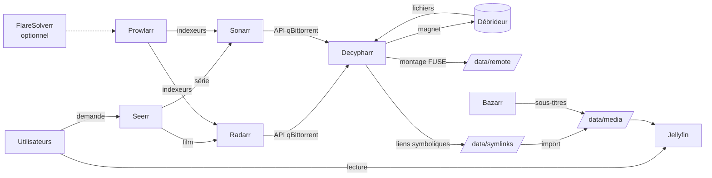

# Architecture

## Vue d'ensemble



Aucun fichier vidéo n'est stocké localement. Le débrideur garde les fichiers ; Decypharr
les expose en système de fichiers (FUSE) ; la bibliothèque n'est faite que de liens
symboliques vers ce montage.

## Rôle de chaque service

| Service | Rôle | Pourquoi lui |
|---|---|---|
| **Jellyfin** | Lecture, transcodage, comptes utilisateurs | Libre, sans compte en ligne |
| **Seerr** | Interface de demande, connexion avec les comptes Jellyfin | Successeur officiel de Jellyseerr et d'Overseerr |
| **Radarr / Sonarr** | Gestion des bibliothèques films / séries : recherche, profils de qualité, renommage, import | Standard de fait, très documentés |
| **Prowlarr** | Gère les indexeurs à un seul endroit et les pousse dans Radarr/Sonarr | Évite de configurer chaque indexeur deux fois |
| **Bazarr** | Sous-titres automatiques | S'appuie sur Radarr/Sonarr pour savoir quoi chercher |
| **Decypharr** | Se fait passer pour qBittorrent auprès des *arr, envoie les magnets au débrideur, monte sa bibliothèque et crée les liens | Montage, réparation et nettoyage de file intégrés : pas de rclone ni de scripts à part |
| **FlareSolverr** | Contourne les protections anti-bot de certains indexeurs | Optionnel (profil Compose) |

## Arborescence

Tous les conteneurs qui manipulent des fichiers voient le même répertoire hôte
(`DATA_DIR`) au **même chemin**, `/data` :

```
/data/remote      montage FUSE du débrideur (Decypharr)
/data/symlinks    téléchargements terminés : liens vers /data/remote/...
/data/media/movies  bibliothèque films (Radarr) : liens importés + sous-titres
/data/media/tv      bibliothèque séries (Sonarr)
```

Un lien symbolique contient un chemin absolu. S'il pointe vers `/data/remote/...`, ce
chemin doit exister à l'identique dans chaque conteneur qui le lit, sinon le lien est
cassé. C'est la raison du chemin unique.

Le chemin unique garantit aussi que `symlinks/` et `media/` sont sur le même système de
fichiers. À l'import, Radarr et Sonarr déplacent le lien ou en font un lien dur, ce qui
laisse un simple lien symbolique. Si le lien dur est impossible (deux systèmes de fichiers
différents), ils se rabattent sur une copie, qui télécharge le fichier en entier.

## Le piège du montage

Le montage FUSE est créé **à l'intérieur** du conteneur Decypharr. Par défaut, un montage
créé dans un conteneur reste invisible partout ailleurs : Jellyfin et les *arr verraient
un dossier `remote/` vide, sans aucune erreur.

Pour qu'il se propage, il faut trois choses :

1. **Côté hôte**, `DATA_DIR` doit être un point de montage en propagation *shared*.
   `make init` fait un bind mount du dossier sur lui-même puis `mount --make-rshared`.
2. **Decypharr** monte `/data` en `rshared` : son montage FUSE remonte vers l'hôte.
3. **Les autres conteneurs** montent `/data` en `rslave` : ils reçoivent les montages de
   l'hôte, sans pouvoir en créer eux-mêmes.

La propagation n'est pas mémorisée par `fstab`. Après un redémarrage de l'hôte, relance
`make init`, ou installe l'unité systemd `media-stack-rshared.service`, que le playbook
Ansible déploie.

`make up` vérifie la propagation avant de démarrer et refuse de lancer la stack si elle
n'est pas en place.

## Conseils d'exploitation

Ils viennent de problèmes réels rencontrés avec ce type de stack.

- **Lire un fichier sur le montage n'est jamais gratuit.** Chaque lecture peut déclencher
  un téléchargement depuis le débrideur. Un script qui « vérifie » la bibliothèque en
  lisant quelques octets de chaque fichier peut générer des centaines de Mbit/s en
  continu. Pour les fichiers morts, utilise la réparation intégrée de Decypharr
  (quotidienne par défaut, voir `repair` dans la config) plutôt qu'un scanner maison.
- **Dans Jellyfin, désactive tout ce qui lit les fichiers en entier** sur ces
  bibliothèques : génération de trickplay et extraction des images de chapitres. Sinon,
  chaque film est téléchargé une fois de plus au scan.
- **Préfère les notifications aux scans planifiés.** Dans Radarr et Sonarr, *Settings →
  Connect → Jellyfin* prévient Jellyfin à chaque import. Si le débrideur est indisponible
  pendant un scan planifié, Jellyfin peut retirer de sa bibliothèque des éléments qu'il
  croit supprimés.
- **Ne fais jamais passer le débrideur par un VPN.** Si tu routes les indexeurs par un VPN
  ou un proxy, exclus explicitement les domaines du débrideur. La plupart des débrideurs
  bloquent les IP de VPN et de datacenter, et peuvent suspendre le compte.
- **N'expose que Jellyfin et Seerr**, derrière un reverse proxy en HTTPS. Radarr, Sonarr,
  Prowlarr, Bazarr et Decypharr sont des interfaces d'administration : garde-les sur le
  réseau local ou derrière un VPN, et active l'authentification de Decypharr
  (*Settings → Auth*) si l'hôte n'est pas isolé.
- **Épingle la version de Decypharr** (`DECYPHARR_TAG`) une fois que tout fonctionne : le
  projet est jeune et change vite.

## Pourquoi pas Riven (v1)

La v1 de ce dépôt (tag [`v1-riven`](../../tree/v1-riven)) reposait sur Riven, un
orchestrateur tout-en-un. Il a été abandonné par ses mainteneurs, demandait des correctifs
du code source et une série de scripts de surveillance pour rester stable. Radarr et Sonarr
sont moins originaux, mais maintenus, largement utilisés et documentés : beaucoup moins de
code à maintenir soi-même.

## Références

- [Decypharr](https://github.com/sirrobot01/decypharr) · [Seerr](https://github.com/seerr-team/seerr)
- [Radarr](https://radarr.video) · [Sonarr](https://sonarr.tv) · [Prowlarr](https://prowlarr.com) · [Bazarr](https://www.bazarr.media)
- [Jellyfin](https://jellyfin.org) · [FlareSolverr](https://github.com/FlareSolverr/FlareSolverr)
- Propagation des montages Docker : [bind propagation](https://docs.docker.com/engine/storage/bind-mounts/#configure-bind-propagation)
