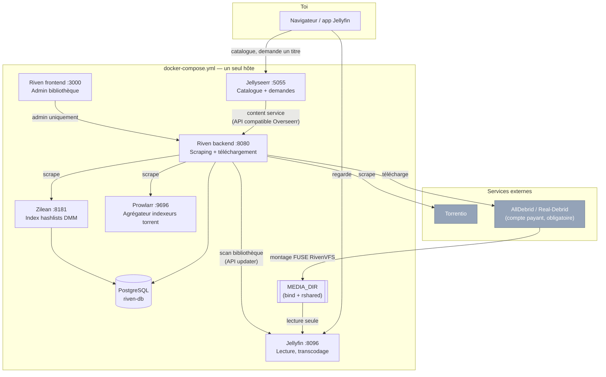

# Architecture

## Vue d'ensemble

## Rôle de chaque service

| Service | Image | Rôle | Brique |
|---|---|---|---|
| **[Jellyfin](https://jellyfin.org)** | `jellyfin/jellyfin` | Serveur média : sert le catalogue, transcode à la volée (VAAPI matériel en option), gère les comptes/profils. C'est l'app que tu ouvres pour *regarder*. | Lecture |
| **[Jellyseerr](https://github.com/fallenbagel/jellyseerr)** | `fallenbagel/jellyseerr` | Interface de demande type Netflix (catalogue TMDB, login délégué à Jellyfin). C'est l'app que tu ouvres pour *demander* un film/série pas encore dans la bibliothèque. | Demande |
| **[Riven](https://github.com/rivenmedia/riven) — backend** | `spoked/riven` | Cœur du pipeline : reçoit les demandes (Jellyseerr, ou directement via son propre frontend), scrape les sources, envoie au débrideur, expose le résultat en tant que filesystem (RivenVFS), notifie Jellyfin. | Orchestration |
| **Riven — frontend** | `spoked/riven-frontend` | UI admin de Riven (état des items, retry manuel, réglages). Pas destinée aux utilisateurs finaux — eux passent par Jellyseerr. | Administration |
| **PostgreSQL** | `postgres:17-alpine` | Base de données de Riven (état des items, historique) **et** de Zilean (deux bases séparées, `riven` + `zilean`, même instance). | Stockage d'état |
| **[Zilean](https://github.com/iPromKnight/zilean)** | `ipromknight/zilean` | Indexe les hashlists DMM (Debrid Media Manager) — un deuxième vivier de sources de scraping en plus de Torrentio/Prowlarr, pour élargir les résultats. | Source de scraping |
| **[Prowlarr](https://github.com/Prowlarr/Prowlarr)** | `lscr.io/linuxserver/prowlarr` | Agrégateur d'indexeurs torrent (indexeurs publics, aucun compte requis pour démarrer). Fournit à Riven une troisième source de scraping, configurable finement (quels indexeurs, quels filtres). | Source de scraping |
| **[Torrentio](https://torrentio.strem.fun)** | *(service externe, pas un conteneur)* | Agrégateur de sources torrent public, interrogé directement par Riven via son API. Aucune configuration requise. | Source de scraping |
| **AllDebrid / Real-Debrid** | *(service externe, pas un conteneur)* | Débrideur cloud : télécharge et héberge le fichier réel, Riven l'expose ensuite en local via RivenVFS. **Compte payant obligatoire** (~4€/mois) — sans ça, Riven trouve des sources mais ne peut rien télécharger. | Stockage réel des fichiers |

## Le piège du montage média

C'est la partie la plus fragile de toute la stack, et la cause la plus probable
si "tout tourne mais Jellyfin ne voit aucun fichier".

**Le principe** : Riven ne stocke rien lui-même. Il monte la bibliothèque du
débrideur en local via **RivenVFS**, un filesystem FUSE qui streame à la
demande. Ce montage FUSE est créé *à l'intérieur* du conteneur `riven`. Pour
que le conteneur `jellyfin` (un processus complètement séparé) puisse voir ces
fichiers, il faut que le montage soit propagé jusqu'à l'hôte, puis re-monté
dans le conteneur `jellyfin`.

**Comment ça marche ici** :

1. `MEDIA_DIR` (répertoire hôte, ex. `./data/media`) est transformé en point de
   montage "partagé" (`mount --bind` sur lui-même, puis `mount --make-rshared`)
   — fait une fois par `make init` / `ansible-playbook ... ` / manuellement
   (`scripts/prepare-media-mount.sh`), voir README §2.
2. Le conteneur `riven` monte ce même chemin avec l'option `rshared` dans
   `docker-compose.yml` (`${MEDIA_DIR}:/mount:rshared`) et y crée son montage
   FUSE (`RIVEN_FILESYSTEM_MOUNT_PATH=/mount/vfs`). Grâce à `rshared`, ce
   sous-montage se propage jusqu'à l'hôte.
3. Le conteneur `jellyfin` monte le **même** `MEDIA_DIR` en lecture seule
   (`${MEDIA_DIR}:/media:ro`) — comme le montage est déjà partagé au niveau de
   l'hôte, Jellyfin voit directement le contenu de RivenVFS.

**Pourquoi `/mount/vfs` et pas `/mount` directement** : Riven démonte puis
remonte son `mount_path` au démarrage — le faire directement sur le point de
montage racine casse la propagation vers l'hôte. Le sous-répertoire évite le
problème.

**Persistance au reboot** : la voie Ansible (`ansible.posix.mount`, `state:
mounted`) écrit une entrée dans `/etc/fstab` pour que ce bind mount survive à
un redémarrage de l'hôte — voulu, mais à savoir si tu supprimes le projet un
jour : `sudo sed -i '\|<chemin du projet>|d' /etc/fstab` avant de faire le
ménage, sinon `/etc/fstab` référence un chemin qui n'existe plus (inoffensif
au boot suivant, juste un warning systemd, mais autant nettoyer). La voie
`make`/shell (`scripts/prepare-media-mount.sh`) ne touche pas `/etc/fstab` —
à relancer manuellement après un reboot si tu ne passes pas par Ansible.

**Si Jellyfin ne voit rien après un `docker compose up -d`** : le montage FUSE
peut apparaître *après* que Jellyfin a démarré et fait son premier scan, selon
l'ordre de démarrage réel. `docker-compose.yml` a un `depends_on: riven:
condition: service_healthy` sur `jellyfin` pour limiter ce risque, mais si ça
arrive quand même : `docker compose restart jellyfin` suffit — pas besoin de
tout redéployer.

**Prérequis** : `/dev/fuse` doit exister sur l'hôte (module `fuse` chargé —
`modprobe fuse` si besoin) ; le conteneur `riven` tourne avec `cap_add:
SYS_ADMIN` + `security_opt: apparmor:unconfined`, requis par RivenVFS, sans
alternative connue à ce jour.

## Deux temps de déploiement

Certaines valeurs de `.env` n'existent qu'*après* le premier démarrage de
chaque service (clé API générée dans son UI). Le déploiement se fait donc en
deux passes :

1. **Premier `docker compose up -d`** avec juste les secrets qui ne dépendent
   de rien (`RIVEN_BACKEND_API_KEY`, `RIVEN_AUTH_SECRET`, clé débrideur) — les
   services démarrent, chacun affiche son assistant de première configuration.
2. **Onboarding dans chaque UI** (voir README §3), report des clés générées
   dans `.env`, puis `docker compose up -d` à nouveau pour les propager.

Les garde-fous (`scripts/`, `make guards`) ne peuvent être installés qu'après
cette deuxième passe — ils dépendent de `JELLYFIN_API_KEY` et
`RIVEN_BACKEND_API_KEY`.

## Garde-fous (`scripts/`)

Riven et Jellyfin, sous charge réelle, ont quelques angles morts connus
(items qui restent bloqués sans jamais retenter, cache qui grossit sans
limite, montage temporairement indisponible pendant un scan...). Les scripts
de `scripts/` sont des correctifs opérationnels indépendants, installés comme
timers systemd sur l'hôte (pas dans les conteneurs) :

| Script | Fréquence | Corrige |
|---|---|---|
| `riven-playback-guard.py` | 2 min | Met en pause le scraping/téléchargement en arrière-plan pendant une lecture active, pour ne pas saturer la connexion au débrideur pendant que quelqu'un regarde. |
| `riven-stall-detector.py` | 15 min | Détecte un figement interne silencieux de Riven (healthcheck HTTP OK mais plus aucune activité) et redémarre le conteneur si nécessaire. |
| `riven-cache-cleanup.py` | 8 h | Vide périodiquement le cache disque RivenVFS (sauf lecture en cours) pour borner le risque de cache corrompu. |
| `riven-episode-retry-guard.py` | 1 h | Relance les épisodes individuels bloqués en `Requested` — le scheduler natif de Riven ne retente que movie/show, jamais les épisodes. |
| `riven-ongoing-watchdog.py` | 30 min | Relance, avec backoff progressif, tout item bloqué en `Unknown`/`Indexed`/`Scraped` depuis plus de 30 min. |
| `jellyfin-disk-guard.py` | 15 min | Purge le cache de transcodage Jellyfin si le disque dépasse 80% d'usage. |
| `jellyfin-scan-guard.py` | 1 h | Vérifie que le montage média est sain avant d'autoriser un scan de bibliothèque — évite qu'une coupure débrideur temporaire soit interprétée comme des fichiers supprimés. |

Détail de chaque script en tête de son fichier. Installation : `make guards`
ou `ansible-playbook ansible/deploy-media-stack.yml --tags guards`.

## Références

- [Jellyfin](https://jellyfin.org) — [doc](https://jellyfin.org/docs/) · [image Docker](https://hub.docker.com/r/jellyfin/jellyfin)
- [Riven](https://github.com/rivenmedia/riven) — [image Docker (`spoked/riven`)](https://hub.docker.com/r/spoked/riven)
- [Jellyseerr](https://github.com/fallenbagel/jellyseerr)
- [Zilean](https://github.com/iPromKnight/zilean)
- [Prowlarr](https://github.com/Prowlarr/Prowlarr)
- [Torrentio](https://torrentio.strem.fun)
- [AllDebrid](https://alldebrid.com) · [Real-Debrid](https://real-debrid.com)
- [Docker Compose](https://docs.docker.com/compose/)
- [Ansible `community.docker`](https://docs.ansible.com/ansible/latest/collections/community/docker/) — module [`docker_compose_v2`](https://docs.ansible.com/ansible/latest/collections/community/docker/docker_compose_v2_module.html)
